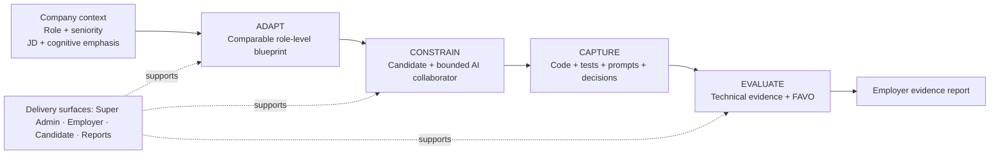

# Constrain, Adapt, Evaluate: Rethinking Coding Assessments for the AI Era

AI is becoming part of everyday software engineering. Developers use it to understand unfamiliar code, explore alternatives, generate tests, debug failures, and accelerate implementation. A technical assessment that asks candidates to pretend these tools do not exist is becoming less representative of the work we actually expect engineers to do.

But the opposite approach creates a different problem. If a candidate receives an unrestricted coding agent that can inspect the entire task, identify every defect, rewrite complete files, and prepare the final explanation, what exactly is the assessment measuring?

This tension led us to build [SignalLoop](https://github.com/signalloop-ai/signalloop), an AI-native candidate evaluator for software engineering hiring. SignalLoop is a collaboration between me, Sreenivas Makam, and my project partner, Ritesh Dhoot. The ideas, product direction, and implementation grew through our work together.

SignalLoop started as a proof of concept. It has grown into a runnable reference implementation with a hosted pilot, but it is not a production-grade hiring system. We are publishing it to demonstrate and test the assessment model, make the design discussable, and invite others to help improve it—not to suggest that it is ready to be adopted unchanged for consequential hiring decisions.

SignalLoop includes the things any usable assessment platform needs: employer and candidate experiences, administration, invitations, test execution, dashboards, scoring, and evidence reports. Those components matter, but they are not the central idea.

The differentiated part of SignalLoop rests on three design choices:

1. **Constrain AI collaboration without pretending AI does not exist.**
2. **Adapt the assessment to the company and role while preserving comparability across candidates.**
3. **Evaluate how the candidate worked, not only the final output.**

We think of these as **Constrain, Adapt, and Evaluate**.

SignalLoop is also a work in progress. Some parts of this model are implemented and running today. Others are foundations or future directions that we are actively exploring. This article describes both, because the open questions are as important as the software already built.

## The architecture behind the three ideas



The portals and dashboards are delivery surfaces around a deeper assessment loop:

```text
Company context + role + JD
              ↓
Comparable role-level assessment blueprint
              ↓
Candidate works with a constrained AI collaborator
              ↓
Code, tests, prompts, snapshots and decisions are captured
              ↓
Technical evaluation + FAVO interpretation
              ↓
Evidence-based employer report
```

Each layer is designed to preserve a different kind of signal: relevance, candidate ownership, and evidence about the engineering process.

## 1. Constrain: allow AI collaboration without allowing AI delegation

There are two easy positions to take on AI in coding assessments.

The first is to prohibit it. That preserves the familiar assessment format, but it increasingly creates an artificial environment. A candidate may be evaluated under conditions that no longer resemble how the employer expects engineers to work.

The second is to allow an unrestricted assistant. That is realistic in one sense, but it can erase the distinction between a candidate who directs and verifies the work and one who delegates the entire task.

SignalLoop takes a position between these extremes. The candidate receives an AI collaborator inside the assessment workspace, but that collaborator is designed to be a **coach, not an autopilot**.

The assistant can:

- explain candidate-visible code and public test output,
- clarify concepts,
- suggest a general debugging approach,
- help reason through one candidate-identified issue,
- compare tradeoffs the candidate has already framed,
- provide bounded implementation help as the candidate demonstrates understanding.

It cannot:

- enumerate every defect in the assessment,
- produce the complete solution,
- rewrite whole files,
- reconstruct hidden tests,
- reveal scoring internals or evaluator material,
- make the candidate's design decisions,
- write the final explanation on the candidate's behalf.

This boundary is enforced in multiple layers. A deterministic pre-gate catches obvious protected requests. A policy-classification component evaluates the intent of the interaction. A separate response-generation component produces help within the allowed boundary. Progressive disclosure lets the assistant become more specific when the candidate has identified the problem and articulated an approach.

SignalLoop also applies an anti-decomposition rule. A candidate should not be able to turn one disallowed request into a full solution by splitting it into a sequence of smaller prompts such as “list every issue,” followed by “give me the code for each issue,” followed by “write every missing test.” The system considers the combined effect of the interaction, not only each message in isolation.

There is another boundary that matters just as much: the AI receives only candidate-visible information. Hidden tests, seeded issue lists, reference solutions, evaluator notes, and scoring internals are never part of the assistant's context.

This constrained collaborator is implemented today. It is not perfect, and policy evaluation will require continued testing and calibration, but it lets us ask a more useful question than “Did the candidate use AI?”

The better question is:

> How did the candidate divide responsibility between themselves and the AI?

A prompt such as “Find every bug and fix the project” tells us something different from “The duplicate-email test is failing; I think normalization is missing. What should I inspect before I change the behavior?”

The interaction itself becomes evidence.

## 2. Adapt: tailor the assessment to the role, not arbitrarily to each candidate

Most engineering assessments face a relevance problem. A single generic coding exercise is easy to administer and compare, but it may be only loosely related to the role. A fully personalized assessment may be more relevant, but it can destroy comparability.

SignalLoop's design principle is:

> Adapt across companies and roles. Preserve consistency within a hiring cohort.

The intended role-level blueprint is derived from inputs that belong to the hiring decision:

```text
Company context
+ hiring area
+ role and seniority
+ job description
+ cognitive areas to emphasize
+ target duration
→ role-level assessment blueprint
```

Company context matters because the same job title can imply very different engineering work.

A backend engineer at a fintech company may need stronger evidence around authorization, auditability, data boundaries, and failure handling. A backend engineer at an AI-infrastructure company may need more emphasis on control-plane APIs, observability, reliability, deployment tradeoffs, and safe AI-assisted debugging.

The JD may be similar, but the assessment emphasis should not necessarily be identical.

Once the employer reviews and approves a blueprint, however, every candidate for that role should receive the same scored assessment. This creates a stable evidence surface for comparison. An employer can create a new version of the role assessment, but SignalLoop should not silently generate an easier or harder scored task for each applicant.

Candidate resumes can still add value. They can inform:

- skill gaps to probe during an interview,
- claims that require validation,
- candidate-specific follow-up questions,
- report caveats and interviewer notes.

They should not initially determine:

- which scored questions the candidate receives,
- the scoring rubric,
- the time allocation,
- the required coverage for the role.

This distinction is important. Personalization is not automatically fairness. A candidate-specific test may look intelligent while making employer comparisons less defensible.

### What exists today

SignalLoop currently implements guided role matching. An employer can provide the role, JD, seniority, team or domain context, expected AI usage, and an optional resume. The system maps the inputs to a versioned skill taxonomy, recommends the closest supported assessment pack, and explains:

- directly tested skills,
- partially tested skills,
- unsupported skills,
- the rationale for the match,
- suggested interview follow-ups.

The current executable coverage is deliberately narrow: SignalLoop can recommend a Standard or Advanced FastAPI assessment. If a frontend or data-engineering JD is outside current executable coverage, the product says so instead of pretending that a backend score evaluated those skills.

The project therefore demonstrates the role-matching model today; it does not yet claim to be a complete dynamic question composer. The consolidated roadmap later in this article explains that next layer.

## 3. Evaluate: measure the engineering process, not only the output

Traditional coding assessments typically emphasize the final artifact:

- Did the tests pass?
- Is the code readable?
- Was the task completed on time?
- What was the final score?

Those signals remain important. AI-assisted engineering, however, introduces additional questions.

- Did the candidate understand the problem before changing code?
- Did they recognize ambiguity and risk?
- Did they ask AI focused questions or delegate wholesale?
- Did they verify AI-assisted changes?
- Did they add meaningful tests?
- Can they explain and defend the final result?

SignalLoop organizes this process evidence through **FAVO: Frame, Ask, Verify, Own**.

### Frame

Did the candidate understand the problem, constraints, risks, and ambiguous requirements? Did their implementation reflect deliberate prioritization and product judgment?

### Ask

How did the candidate use AI? Were the questions focused and grounded in an identified behavior, or did the candidate attempt to outsource the complete solution?

### Verify

Did the candidate run tests, add tests, inspect edge cases, revisit assumptions, and validate changes after receiving AI assistance?

### Own

Could the candidate explain what changed, why they made particular tradeoffs, what remains uncertain, and what they would improve next?

Candidates do not manually write a FAVO score. SignalLoop derives the interpretation from captured evidence such as:

- code snapshots,
- public and hidden test runs,
- candidate-written tests,
- AI conversations and policy redirects,
- large code-paste signals,
- final submission-review answers,
- the consistency between the explanation and submitted code.

The Engineering Evidence Report combines this with the technical evaluation. FAVO is not intended to replace correctness, and it is not a personality or psychometric score.

The technical score tells the employer what worked. FAVO helps explain how the candidate got there and whether the process is trustworthy.

An initial deterministic version of this interpretation is implemented today. Some signals are necessarily simple proxies: prompt counts, test runs, candidate test files, feature behavior, hidden-test status, and submission-review completeness. Improving and validating those mappings is part of the consolidated roadmap below.

## What exists today and what comes next

Rather than scatter the project status across the three ideas, here is the boundary in one place.

### Constrain

**Implemented today:** A constrained assistant, candidate-visible context boundary, policy classification, progressive disclosure, anti-decomposition behavior, interaction logging, and evidence capture.

**Next:** Stronger adversarial testing, policy-evaluation datasets, progressive-disclosure calibration, and better measures for distinguishing productive coaching from disguised delegation.

### Adapt

**Implemented today:** Guided role matching from role, JD, seniority, team or domain context, and optional resume information to the closest registered assessment pack. The result includes tested, partially tested, and unsupported skill coverage. The question-bank governance foundation also supports provenance, draft review, and approval.

**Next:** Compose role-level assessments from approved and calibrated questions:

```text
Role/company/JD/cognitive requirements
              ↓
Required assessment slots
              ↓
Approved question bank
              ↓
Reviewable role-level blueprint
              ↓
Employer approval or same-slot swaps
              ↓
Reusable assessment for the candidate cohort
```

This requires connecting the question bank to employer blueprint creation, candidate delivery, and evidence-report scoring while preserving the same scored assessment for candidates in the same cohort.

### Evaluate

**Implemented today:** Deterministic technical scoring, public and hidden test evidence, AI-interaction evidence, submission review, timeline capture, and an initial FAVO interpretation.

**Next:** Better evidence mappings, evaluator calibration, longitudinal validation, clearer evidence limits, and research into which signals are reliable, useful, fair, and resistant to superficial gaming.

## Seeing the complete workflow

The short demo below shows the current end-to-end SignalLoop experience: super-admin visibility, employer assessment setup, the candidate workspace with constrained AI, and the resulting evidence report.

https://github.com/user-attachments/assets/af7447b7-1725-4af2-add4-6d0c082c331b

If the inline player is unavailable, [watch the demo from the SignalLoop repository](https://github.com/signalloop-ai/signalloop/blob/main/docs/assets/demo/signalloop-demo.mp4).

## What SignalLoop deliberately does not claim

Being explicit about the boundaries is important.

SignalLoop does not treat AI use itself as misconduct. It evaluates how the candidate uses it.

It does not allow the embedded assistant to complete the assessment or access evaluator-only artifacts.

It does not currently give every candidate a different scored test. The role-level assessment is intended to remain comparable across the cohort.

It does not convert unsupported skills into implied evidence. If the current assessment cannot test an area, the report should identify the gap.

It does not reduce a hiring decision to one number. The report is evidence for employer review, not an autonomous hiring decision.

And it does not yet implement the entire adaptive question-composition vision described here.

## From proof of concept to production-grade system

The distinction between a working reference implementation and a production system matters, especially in hiring.

SignalLoop began as a POC to explore whether constrained AI collaboration and process evidence could produce a better assessment signal. The current system demonstrates the complete workflow: employers can create invites, candidates can work in a browser with a constrained assistant, tests and interactions are captured, and evidence reports can be generated.

That proves the product loop. It does not complete the production journey.

A production-grade version would still need work in areas such as:

- isolated and hardened execution infrastructure for untrusted candidate code,
- private, calibrated assessment content rather than public demo packs,
- production authentication, secrets management, monitoring, backups, and incident response,
- explicit data-retention, consent, privacy, and compliance policies,
- accessibility, abuse testing, rate-limit hardening, and operational support,
- evaluator calibration and studies of reliability, validity, bias, and adverse impact,
- question effectiveness analytics and ongoing assessment-version governance,
- human review processes appropriate for consequential hiring decisions.

Some technical scaffolding and product foundations for these areas exist in the repository. Others remain design and validation work. We would not recommend using the current project as an autonomous hiring system, and we do not believe any evidence report should replace accountable human judgment.

## How you can help

The project is a working reference implementation and a foundation for further exploration. The roadmap above is intentionally open. We are particularly interested in privacy, fairness, question effectiveness, assessment versioning, policy evaluation, and methods for evaluating AI-assisted engineering without rewarding superficial activity.

SignalLoop is available on [GitHub](https://github.com/signalloop-ai/signalloop). It is joint work by Sreenivas Makam and Ritesh Dhoot, and the next phase of the project is intentionally open to a wider community of contributors and critics.

If you are working on technical hiring, assessment design, AI safety, developer tools, or evidence-based evaluation, we would value your feedback. Contributions, critique, experiments, question-bank ideas, evaluator studies, and help with any of these future directions would be genuinely appreciated.

The central idea is simple:

> Do not ask whether candidates used AI. Design the assessment so that their use of AI produces meaningful evidence.

Constrain the collaboration. Adapt the assessment. Evaluate the process.

---

## WordPress publication checklist

Remove this section before publishing.

- **Architecture diagram:** Upload `docs/assets/blog/signalloop-three-layer-architecture.png` to the WordPress Media Library and insert it as an Image block. The PNG is a high-resolution 2880 × 1640 export; the SVG remains available as the editable source.
- **Inline demo:** The MP4 already exists at `docs/assets/demo/signalloop-demo.mp4`. Upload it to the WordPress Media Library and insert it as a native Video block in the “Seeing the complete workflow” section. Keep the GitHub-hosted link as a fallback.
- **Repository visibility:** Make the GitHub repository public before the article goes live so that the repository and fallback demo links work for readers.
- **Excerpt field:** In the WordPress editor, open **Post → Excerpt** in the right sidebar and paste: “AI-native coding assessments should not ban AI or allow unlimited delegation. SignalLoop explores a third model: constrain collaboration, adapt assessments at the role level, and evaluate the engineering process through evidence.” This is publication metadata, not part of the article body.
- **Tags field:** In the WordPress editor, open **Post → Tags** in the right sidebar and add: AI, Software Engineering, Technical Hiring, Coding Assessments, Developer Tools, Open Source.
